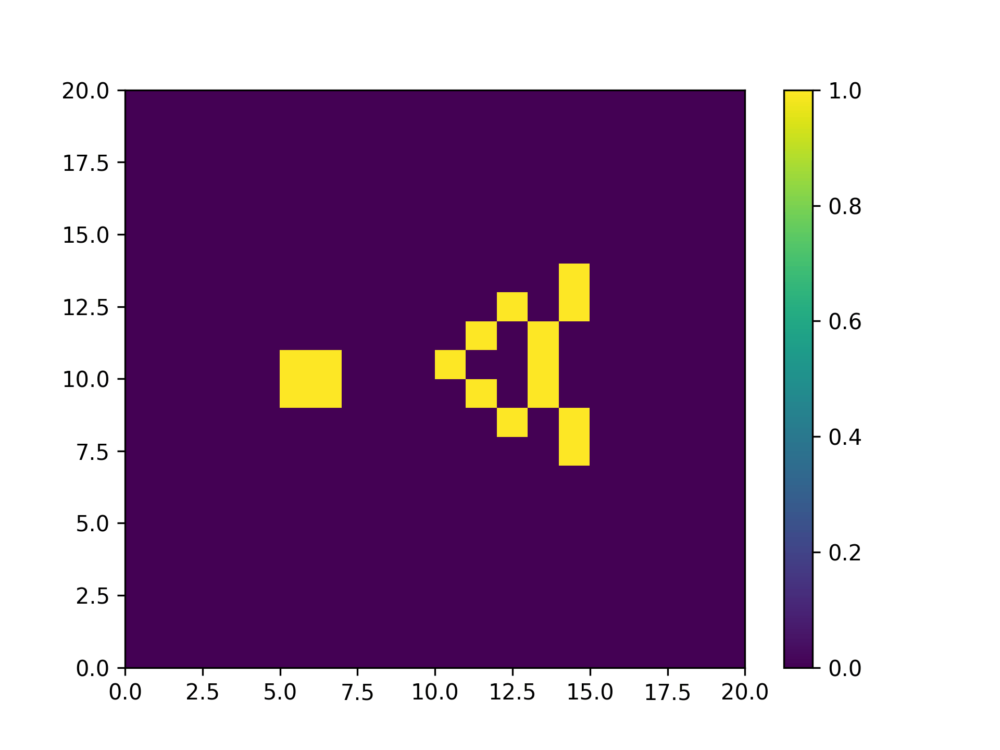

# Conway's game of life

A simple python program to simulate and visualise the Conway's Game of life



## Usage:

Clone this repository:
```
git clone https://github.com/dhravya/game-of-life
```

Install the dependencies:
```
pip install -r requirements.txt
```

Run :
```
python game-of-life.py
```

## Contributing:
Any contributions are welcome and appreciated.

## License
This project is licensed under the [MIT](./LICENSE) license.